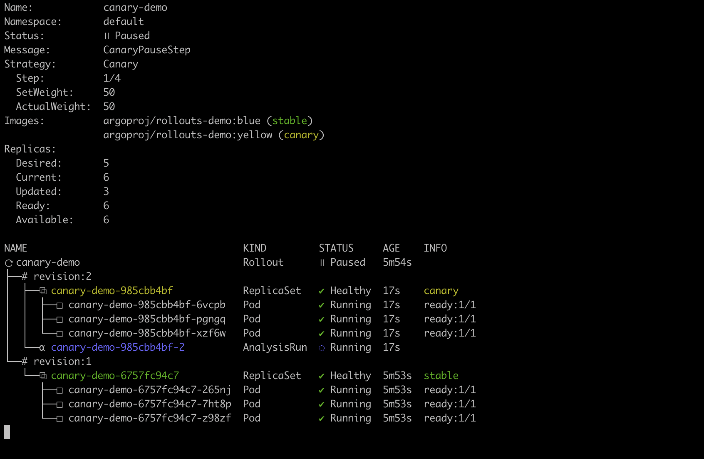
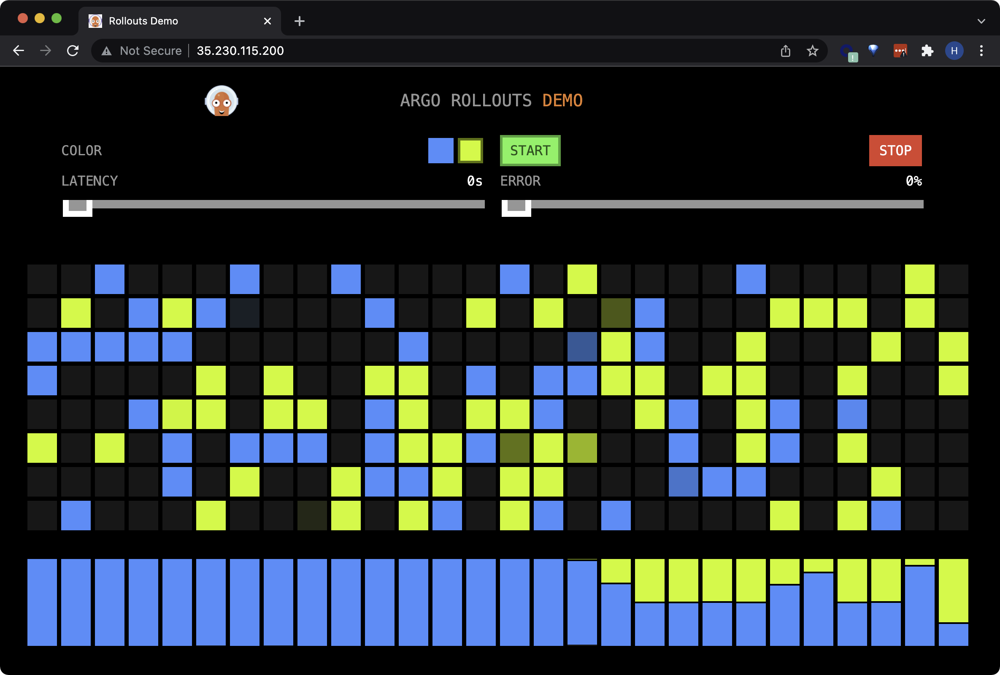
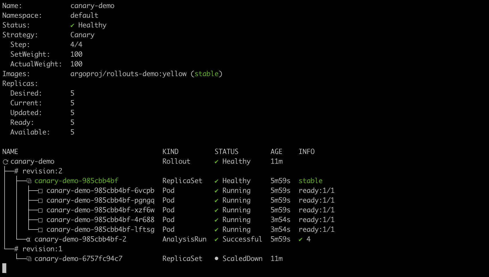

# Canary Releases with Argo Rollouts and Pixie

Use Pixie analytics to drive canary releases to make your application deployment process safer and faster. [Canary Releases with Argo Rollouts and Pixie](https://blog.px.dev/argo-rollouts) is the accompanying blog post for this demo.

## What is this demo?

This demo uses [Pixie](https://github.com/pixie-io/pixie) to perform canary analysis on the Argo Rollouts [canary analysis example project](https://github.com/argoproj/rollouts-demo). A Pixie metrics server is deployed with an endpoint that returns HTTP error rate per specified pod. This error rate is used by the Argo Rollouts controller to determine whether to promote or rollback an application upgrade.

## Requirements

- A Kubernetes cluster. If you don't already have one, follow [these directions](https://docs.px.dev/installing-pixie/setting-up-k8s/minikube-setup) to create a minikube cluster.
- [Install](https://docs.px.dev/installing-pixie/install-guides/) Pixie into the cluster
- [Install](https://kubernetes.io/docs/tasks/tools/#kubectl) `kubectl`
- [Install](https://kubectl.docs.kubernetes.io/installation/kustomize/) `kustomize`

## Setup the Pixie Metrics Server

1. Clone this repo and navigate to the `argo-rollouts-demo` folder:

```
git clone https://github.com/pixie-io/pixie-demos.git
cd pixie-demos/argo-rollouts-demo
```

2. Create a secret containing the Pixie API credentials for your Kubernetes cluster:

```
# Get your current cluster name from your Kubernetes context.
kubectl config current-context

# Get the Pixie Cluster ID for the above cluster name.
# Record the value of the `ID` column for this cluster.
px get viziers

# Create an API key. Record the value of the `Key` parameter.
px api-key create

# Create `px-metrics` namespace.
kubectl create namespace px-metrics

# Create the secret.
kubectl -n px-metrics create secret generic px-credentials --from-literal=px-api-key=<YOUR API KEY VALUE HERE> --from-literal=px-cluster-id=<YOUR CLUSTER ID VALUE HERE>
```

3. Install the Pixie metrics server onto your cluster with:

```
kubectl apply -f px-metrics.yaml
```

## Setup the Demo Application

1. [Install](https://argoproj.github.io/argo-rollouts/installation/#controller-installation) Argo Rollouts onto your cluster with:

```
kubectl create namespace argo-rollouts
kubectl apply -n argo-rollouts -f https://github.com/argoproj/argo-rollouts/releases/latest/download/install.yaml
```

2. [Install](https://argoproj.github.io/argo-rollouts/installation/#kubectl-plugin-installation) the Argo Rollouts `kubectl` plugin. To use Homebrew, run:

```
brew install argoproj/tap/kubectl-argo-rollouts

```

2. Apply the manifests (including the application [Rollout](https://github.com/pixie-io/pixie-demos/tree/main/argo-rollouts-demo/canary/rollout-with-analysis.yaml) and [AnalysisTemplate](https://github.com/pixie-io/pixie-demos/tree/main/argo-rollouts-demo/canary/pixie-analysis.yaml)):

```
kustomize build . | kubectl apply -f -
```

3. Get the `EXTERNAL-IP` address for the `canary-demo-preview` service:

```
kubectl get svc canary-demo-preview
```

4. Navigate to the External IP in your browser to access the demo application front-end. Leave this open.

<br>

<br>

Each of these colorful squares is a request the browser is making to the backend.

The backend responds with a color that indicates which version of the app it is. In this case we're getting blue boxes for the application image with the `blue` tag set in the [Rollout](https://github.com/pixie-io/pixie-demos/tree/main/argo-rollouts-demo/canary/rollout-with-analysis.yaml) yaml.

The bar chart at the bottom represents the percentage of requests that were handled by the different backends (stable, canary). We will see this in action in a minute.

<br clear="all">

## Successful Canary Rollout

1. Watch the rollout live with the following command. Leave this tab open.

```
kubectl argo rollouts get rollout canary-demo --watch
```

2. In another tab, modify the [Rollout](https://github.com/pixie-io/pixie-demos/tree/main/argo-rollouts-demo/canary/rollout-with-analysis.yaml) application image to trigger an upgrade:

```
kubectl argo rollouts set image canary-demo "*=argoproj/rollouts-demo:yellow"
```

3. You should now see blue (stable) running alongside yellow (canary):

<br>

<br>

On our first step, we direct 50% of traffic to the `blue` release and 50% to `yellow` release.

Argo Rollouts splits traffic between versions by creating a new replica set that uses the same service object and the service will still split the traffic evenly across pods (new and old). In other words, controlling the number of pods controls the traffic percentage.

Our analysis is measuring the HTTP error rate for the canary pods every 30 seconds.

<br clear="all">

4. Let's look at our front-end:

<br>

<br>

The bar chart on the bottom shows us that the requests are being roughly equally split between the `blue` (stable) and `yellow` (canary) versions.

<br clear="all">

5. Let's check the kubectl plugin:

<br>

<br>

After 2 minutes, the error rate has met the success criteria and the `yellow` canary image is fully promoted.

<br clear="all">

## Unsuccessful Canary Rollout (HTTP error rate)

1. Let's again modify the image tag of the application Rollout to trigger an upgrade. This time we'll update it to a buggy application image which returns 500 errors for most requests.

```
kubectl argo rollouts set image canary-demo "*=argoproj/rollouts-demo:bad-red"
```

2. Let's look at our front-end:

<br>

<br>

We see requests being made to the yellow (stable) and red (canary) version.

<br clear="all">

3. Let's check the kubectl plugin:

<br>

<br>

After 30 seconds or so (the length of time it takes to get the analysis results back), the analysis should return an HTTP error rate that does not meet the `successCondition` defined in the `pixie-analysis.yaml` file).

The rollout fails and automatically rolls back to the stable `yellow` version.

<br clear="all">

4. To see the result of the analysis run:

```
kubectl get analysisrun
kubectl get <ANALYSISRUN_NAME> -o yaml
```

5. Let's inspect the results of the analysis run:

<br>

<br>

The analysis run output shows us the value Pixie measured for HTTP error rate of the canary release.

The HTTP error rate value of 82% is well above the criteria we defined for a successful release.

Note that if you don't have the front-end open in your browser, no requests will be made to the backend (meaning no errors will be returned) so Pixie will report an error rate of 0.

<br clear="all">

## Development

This tutorial used Pixie to analyze the performance of the canary deployment. Pixie can generate many different types of metrics, not just HTTP error rate and latency by pod.

Pixie can generate metrics by pod, service, node, or container.

Other example metrics Pixie can generate:

- Latency, error rate, and throughput for our [supported protocols](https://docs.px.dev/about-pixie/data-sources/#supported-protocols).
- Latency, error rate, and throughput by request path (including wildcards, such as /orders/*/item/*)
- System metrics such as CPU, network utilization, memory utilization
- Application CPU profiles
- See our [example PxL scripts](https://github.com/pixie-io/pixie/tree/main/src/pxl_scripts) for additional examples

If you'd like to modify the Pixie metrics server to return different metrics, you'll need to build and deploy a new version:

1. Make your changes to `pixie_metrics_server/pixie-metric-provider.go` and build a new version of the server image:

```
docker build . -t <YOUR DOCKER IMAGE PATH HERE>
```

2. (Optional) Push your version of the image. This is not necessary if your cluster has access to your local Docker images.

```
docker push <YOUR DOCKER IMAGE PATH HERE>:latest
```

3. Depending on your ImagePullPolicy, delete and recreate the `px-metrics` deployment:

```
kubectl -n px-metrics delete deployment px-metrics
kubectl apply -f px-metrics.yaml
```

## Bugs & Features

Feel free to file a bug or an issue for a feature request. You can also join our [Slack](https://slackin.px.dev/) community.
