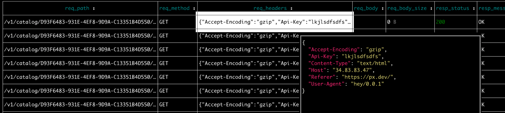

# Observability for Feature Deprecation

Want to deprecate an API? Use [Pixie](https://github.com/pixie-io/pixie) to quickly determine:

- Is this endpoint used?
- Who is using this endpoint?

[Can I deprecate this endpoint?]( https://blog.px.dev/endpoint-deprecation) is the accompanying blog post for this demo.

## Prerequisites

- If you don't already have one, set up a [Kubernetes cluster](https://docs.px.dev/installing-pixie/setting-up-k8s/).
- [Install Pixie](https://docs.px.dev/installing-pixie/install-guides/) to your Kubernetes cluster.
- Install the [Pixie CLI](https://docs.px.dev/installing-pixie/install-schemes/cli/#1.-install-the-pixie-cli) if you didn't install it in order to deploy Pixie in the step above.
- Git clone this repository and `cd` into the `endpoint-deprecation` folder.

## Test Application

1. Install [hey](https://github.com/rakyll/hey). Homebrew users can use:

```
brew install hey
```

2. Deploy an echo server to receive arbitrary client requests:

```
# echo-service will be created in the `default` namespace.
kubectl apply -f demo-app.yaml
```

3. Get the external IP for `echo-service` and save it in an environment variable:

```
kubectl get services
export ECHO_SERVICE_IP=<EXTERNAL IP>
```

4. Run the test load. `-H` is used to pass a custom HTTP header.

```
for i in {1..15}; do
hey -H "Referer:https://example.com/" -H "API-KEY:abcdef12345" -n 550 "http://${ECHO_SERVICE_IP}/v1/catalog/"
hey -H "Referer:https://px.dev/" -H "API-KEY:lkjlsdfsdfs" -n 50 "http://${ECHO_SERVICE_IP}/v1/catalog/$(uuidgen)/details"
hey -H "Referer:https://example.com/" -H "API-KEY:abcdef12345" -n 50 "http://${ECHO_SERVICE_IP}/v1/catalog/$(uuidgen)/details"
hey -H "Referer:https://example.com/" -H "API-KEY:sdfsdfsdfsd" -n 50 "http://${ECHO_SERVICE_IP}/v1/catalog/$(uuidgen)/details"
hey -H "Referer:https://google.com/" -H "API-KEY:sdfsdfsdfsd" -n 50 "http://${ECHO_SERVICE_IP}/v2/catalog/$(uuidgen)"
done
```

## Service Traffic Clustered by Logical Endpoint

From the top-level `endpoint-deprecation` folder, run:

```
px live -f service_endpoints_summary -- -start_time '-30m' -service 'default/echo-service'
```

This PxL sript takes a `service` argument. Note that Pixie formats service names in the `<namespace>/<service>` format.


To see timeseries graphs for endpoint latency, error and throughput, run the following command and then click the `Live View` link at the top:

```
px live pxbeta/service_endpoints -- -start_time '-30m' -service 'default/echo-service'
```

## Full-body HTTP/2 Requests for the Specified Endpoint

From the top-level `endpoint-deprecation` folder, run:

```
px live -f service_endpoint_requests -- -start_time '-30m' -service 'default/echo-service' -endpoint '/v1/catalog/*/details'
```



To inspect truncated table cells (e.g. `req_headers`), select the cell then press `enter`. To exit the expanded view, use `esc`.

## A List of Unique Request Header Field Values

From the top-level `endpoint-deprecation` folder, run:

```
px live -f unique_req_header_values -- -start_time '-30m' -service 'default/echo-service' -endpoint '/v1/catalog/*/details'
```


This script only examines two request header fields (Referer and Api-Key), but the `.pxl` file can be easily modified to inspect other fields.

## How to Interact with the Live CLI

For more information on how to interact with the Live CLI, including sorting columns, expanding truncated table cells and more, check out the [reference docs](https://docs.px.dev/using-pixie/using-cli/#use-the-live-cli).

## How to Run Scripts in the Live UI

PxL scripts can be run using the [CLI](https://docs.px.dev/using-pixie/using-cli/#use-the-live-cli) or [Live UI](https://docs.px.dev/using-pixie/using-live-ui). This tutorial demonstrated the CLI. To run these scripts in the Live UI:

- Open the Live UI.
- Select the `Scratch Pad` script from the script drop-down menu in the top left.
- Open the script editor using `ctrl+e` (Windows, Linux) or `cmd+e` (Mac).
- Copy the contents of the `.pxl script` file into the “PxL Script” tab of the script editor.
- Copy the contents of the `vis.json` file into the “Vis Spec” tab of the script editor.
- Run the script using the RUN button in the top right or using the `ctrl+enter` (Windows, Linux) or `cmd+enter` (Mac) shortcut.
- Hide the script editor using `ctrl+e` (Windows, Linux) or `cmd+e` (Mac).

## A Note on Data Retention

Note that the PxL scripts above only examine the last 30 minutes of traffic. This time window can be extended by changing the `start_time` variable (e.g. to use `-3h`). For more information on how much data Pixie stores, see the [reference docs](https://docs.px.dev/about-pixie/faq#how-much-data-does-pixie-store).

## Bugs & Features

Feel free to file a bug or an issue for a feature request. You can also join our [Slack](https://slackin.px.dev/) community.
