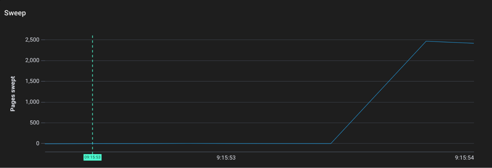
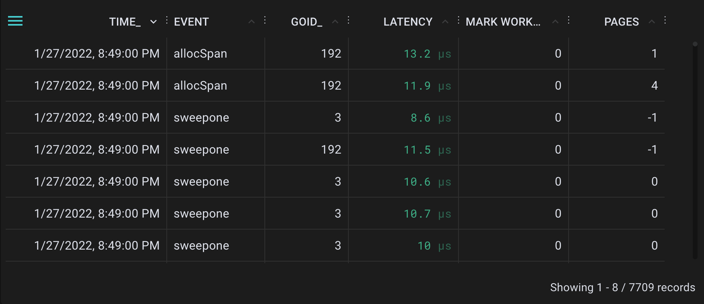

# Instrumenting the Go Garbage Collector with eBPF uprobes

Instrument the internals of the Golang garbage collector to visualize its behavior. [Dumpster-diving the Go Garbage Collector](https://blog.px.dev/go-garbage-collector) is the accompanying blog post for this demo.



## What is this demo?

This demo provides instructions for using [Pixie](https://github.com/pixie-io/pixie) to instrument the Go garabge collector. It provides an example Go 1.16 application as well as the specification for the probes in [PxL](https://docs.px.dev/reference/pxl/).



You can use this demo to visualize the following:
- GC events and their latencies and timestamps
- Pages allocated, marked, and swept in the Go runtime over time
- The amount of assist work done by the runtime over time
- The trigger ratio for the garbage collector over time

## Prereqquisites

* If you don't already have one, set up a [Kubernetes cluster](https://docs.px.dev/installing-pixie/setting-up-k8s/)
* [Install Pixie](https://docs.px.dev/installing-pixie/install-guides/) to your Kubernetes cluster

## Usage

Notes before beginning: 
- This demo uses the [Dynamic Go Logging](https://docs.px.dev/tutorials/custom-data/dynamic-go-logging/) feature of Pixie. This feature is in still in alpha.
- This demo uses an application running Go 1.16. It will not work on other versions of Go. See the [docs](https://docs.px.dev/tutorials/custom-data/dynamic-go-logging/#requirements-and-limitations-requirements) for more information about what is supported.

1. Deploy the test application.

```
# Will be created in the `default` namespace
kubectl apply -f demo-app.yaml
```

2. Get the name of the pod you just deployed, starting with `gc-service`.

```
kubectl get pods
```

3. `git clone` this repo.

4. In a text editor, open the `.pxl` files in the `pxl_scripts/uprobe_scripts` directory. Fill in the `pod` variable at the top of each of the scripts to be `default/gc-service-<rest of pod name>`.

5. Open the Pixie UI and navigate to the [Scratch Pad](https://docs.px.dev/using-pixie/using-live-ui/#write-your-own-pxl-scripts-use-the-scratch-pad).

6. Follow the [Scratch Pad](https://docs.px.dev/using-pixie/using-live-ui/#write-your-own-pxl-scripts-use-the-scratch-pad) instructions to run the canary script at `pxl_scripts/uprobe_scripts/_canary_probe.pxl`. You do not need to provide a `vis.json` file. The UI should show that the probe deployment has succeeded, and you should see either a table or empty results.

7. (Skip this step if Step 6 succeeded). If the canary script fails, do not proceed to the next step. Wait a few minutes before trying again. When you try retry, update the value of `canaryTable` to a new string. It needs to be a unique string for every attempt. 

8. Once Step 6 has succeeded, run (as a separate step) each of the scripts from [pxl_scripts/uprobe_scripts]. Make sure you have completed Step 4 and updated the `pod` variable in the `*.pxl` scripts.

9. Set up port-forwarding to the demo application.

```
kubectl port-forward service/gc-service 8126:80
```

10. In a second tab, hit the demo application with some traffic in order to trigger garbage collection. You can vary the arrayLength and bytesPerElement parameters.

```
curl '127.0.0.1:8126/allocate-memory-and-run-gc?arrayLength=10&bytesPerElement=20'
Generated string array with 200 bytes of data
Ran garbage collector
```

11. Visualize the data. Run the script provided in `uprobe_script/visualization` (including both the `vis.json` file and the `*.pxl` script) according to the instructions in the [Scratch Pad](https://docs.px.dev/using-pixie/using-live-ui/#write-your-own-pxl-scripts-use-the-scratch-pad).

 Note: If you get a compiler error similar to `Compiler error on line 24, column 22: Table 'GC' not found..`, go back and re-run the corresponding uprobe PxL script (make sure to clear out the Vis Spec tab in the editor first). 

## Bugs & Features

Feel free to file a bug or an issue for a feature request. You can also join our [Slack](https://slackin.px.dev/) community.
