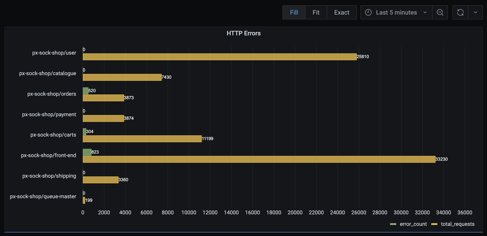
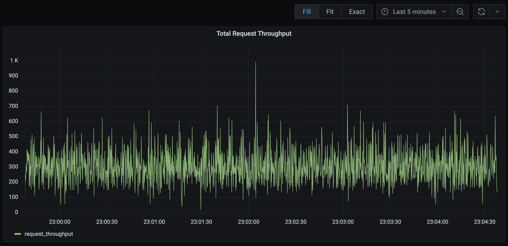
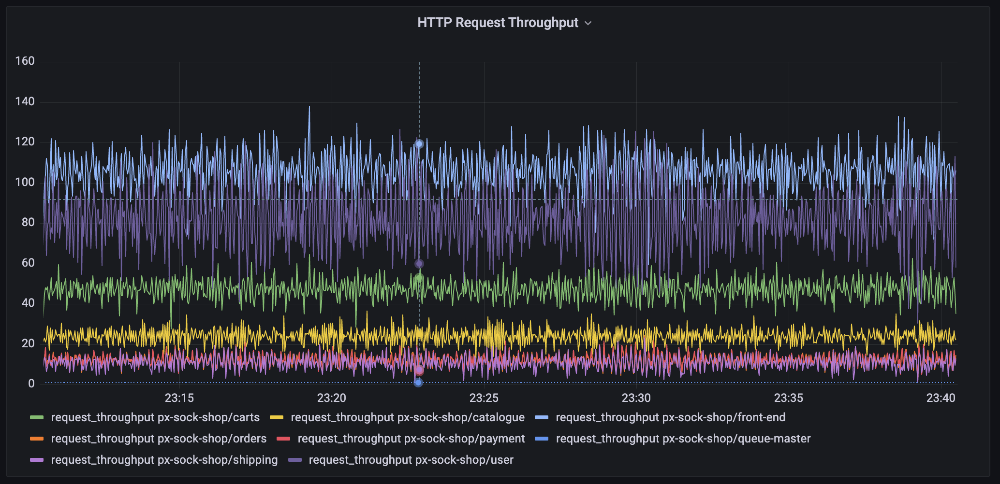
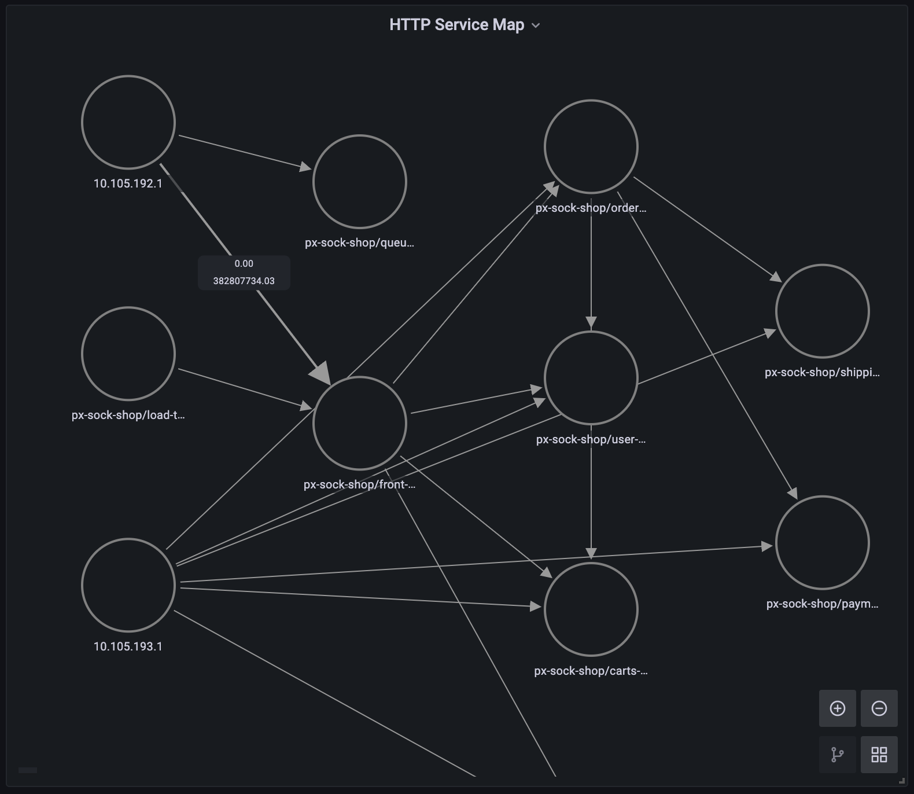
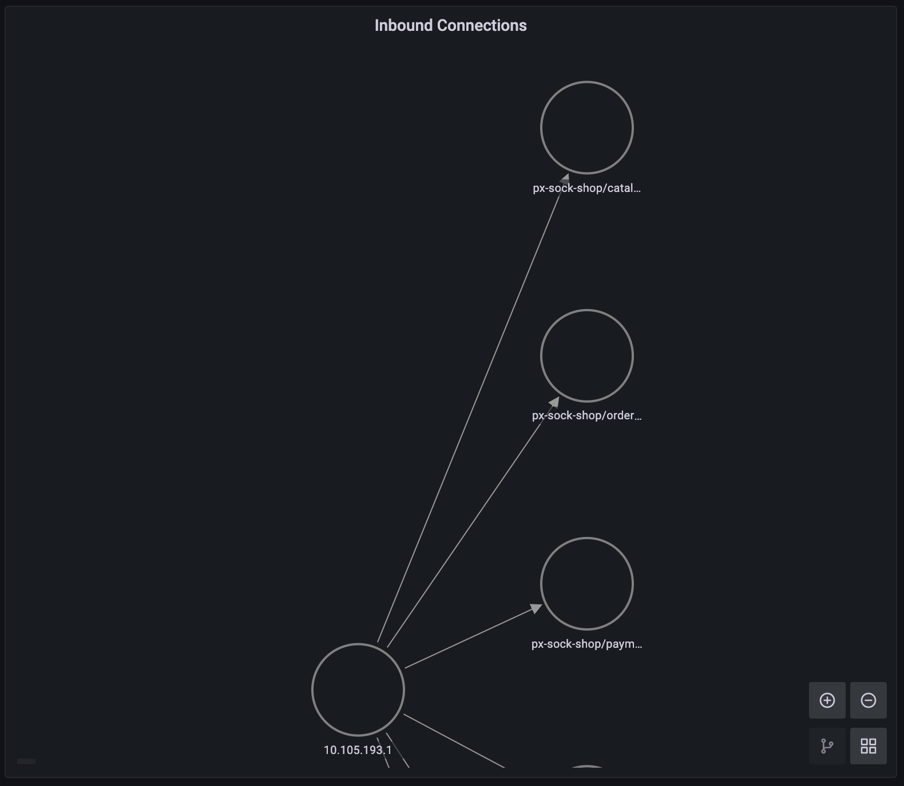
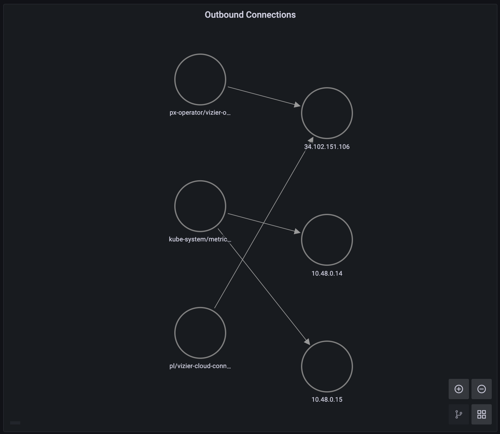
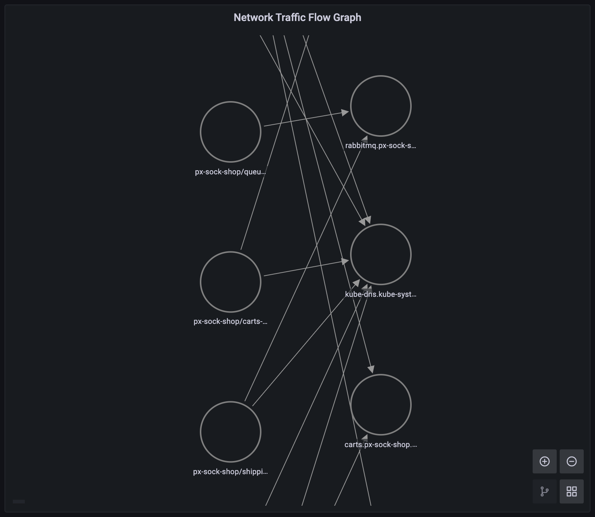

# Grafana Pixie Plugin Examples

The following queries are for use with the [Grafana Pixie Datasource Plugin](https://grafana.com/grafana/plugins/pixie-pixie-datasource/).

To learn how to install, configure, and use the datasource, check out the [tutorial](https://docs.px.dev/tutorials/integrations/grafana/).

## [HTTP Errors per Service](https://github.com/pixie-io/pixie-demos/http-errors-per-service.pxl)

This query outputs a table of HTTP error count per service.

## [HTTP Request Throughput](https://github.com/pixie-io/pixie-demos/http-request-throughput.pxl)

This query outputs a table of time series data showing overall HTTP request throughput.

## [HTTP Throughput per Service](https://github.com/pixie-io/pixie-demos/http-request-throughput-per-service.pxl)

This query outputs a table of time series data for HTTP request throughput per service.

## [HTTP Service Graph](https://github.com/pixie-io/pixie-demos/http-service-traffic-node-graph.pxl)

This query outputs a graph of the HTTP traffic between the services in your cluster. Use with Grafana's node graph panel. Hover over a graph edge to see average error rate (main stat) and P90 latency in milliseconds (secondary stat).

## [Inbound Connections Graph](https://github.com/pixie-io/pixie-demos/inbound-connections-node-graph.pxl)

This query outputs a graph of the inbound connections to your cluster (connections made from external IPs). Use with Grafana's node graph panel. Hover over a graph edge to see Kilobytes sent (main stat) and Kilobytes received (secondary stat).

## [Outbound Connections Graph](https://github.com/pixie-io/pixie-demos/outbound-connections-node-graph.pxl)

This query outputs a graph of the outbound connections from your cluster (connections made to external IPs). Use with Grafana's node graph panel. Hover over a graph edge to see Kilobytes sent (main stat) and Kilobytes received (secondary stat).

## [Network Traffic Graph](https://github.com/pixie-io/pixie-demos/network-traffic-node-graph.pxl)

This query outputs a graph of the network connections to, from and within your cluster. Use with Grafana's node graph panel.

