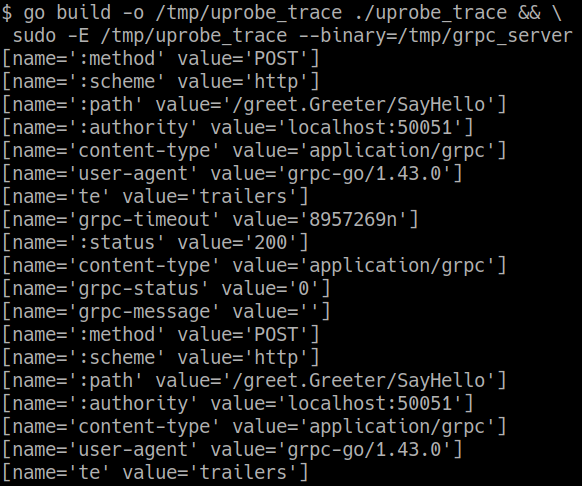

# HTTP/2 Tracing With eBPF Uprobes Demo

Use eBPF uprobes to trace HTTP/2 headers, without any changes to the application code.

## What is this demo?

This demo provides the gRPC client and server, and the uprobe tracer for
[HTTP2 tracing](https://blog.px.dev/http2-tracing) blog post. Follow the instructions provided below
to trace HTTP/2 message headers with eBPF uprobes.

## Prerequisites

* This demo only works on Linux. The code was tested on Ubuntu 20.04.3 LTS with 5.4 kernel.
* Install [BCC](https://github.com/iovisor/bcc/blob/master/INSTALL.md).
* All of the code is written in [Golang](https://go.dev/doc/install).
* Various Go packages might need to be installed, follow the directives to install them when any of
  the `go build` commands failed.
* [OPTIONAL] If you want to modify the gRPC protobuf, you'll need to install:
  [protocol buffer compiler](https://grpc.io/docs/protoc-installation/) and
  [go protobuf plugin](https://grpc.io/docs/languages/go/quickstart/).
* [OPTIONAL] Change `gobpf` version in go.mod if `go build` failed building uprobe tracer with error
  like below:
  ```
  # github.com/iovisor/gobpf/bcc
  ../../../pkg/mod/github.com/iovisor/gobpf@v0.0.0-20200614202714-e6b321d32103/bcc/module.go:261:33:
  not enough arguments in call to _C2func_bpf_attach_uprobe
        have (_Ctype_int, uint32, *_Ctype_char, *_Ctype_char, _Ctype_ulong, _Ctype_int)
        want (_Ctype_int, uint32, *_Ctype_char, *_Ctype_char, _Ctype_ulong, _Ctype_int, _Ctype_uint)
  ```
  In `go.mod, uncomment any of the gobpf versions listed to see which one works on your machine.

## Usage

Run the commands below to see the uprobe tracer tracing the HTTP/2 messages from the gRPC server to
client:

```
# Build and launch gRPC server.
go build -o /tmp/grpc_server server/main.go && /tmp/grpc_server

# Build and launch the uprobe tracer.
# If failed, see instructions in the previous section.
go build -o /tmp/uprobe_trace ./uprobe_trace && \
 sudo -E /tmp/uprobe_trace --binary=/tmp/grpc_server

# Build and launch gRPC client.
go build -o /tmp/grpc_client client/main.go && /tmp/grpc_client --count 10
```

The output of the uprobe tracer looks like:



If you have modified the gRPC proto file, you'll need to run the following command to update the
generated go source files for the gRPC service:

```
protoc --go_out=. --go-grpc_out=. --go-grpc_opt=require_unimplemented_servers=false proto/greet.proto
```

## Bugs & Features

Feel free to file a bug or an issue for a feature request. You can also join our
[Slack](https://slackin.px.dev/) community.
