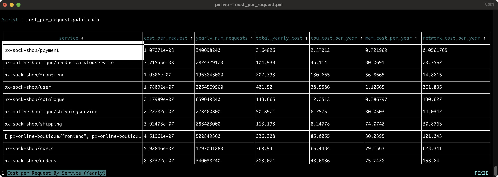

# Kubernetes Cluster Cost Estimation

These PxL scripts demonstrate how to use telemetry data automatically provided by Pixie to estimate the cost of your Kubernetes cluster.

- **cpu_cost.pxl**: Estimates yearly CPU cost per Service based on last hour of usage.

- **mem_cost.pxl**: Estimates yearly memory cost per Service based on last hour of usage.

- **network_cost.pxl**: Estimates yearly network cost per Service based on last hour of usage.

- **cost_per_request.pxl**: Estimates yearly number of requests per Service based on last hour of usage.

## Instructions

1. Install Pixie on your Kubernetes cluster. If you do not have a cluster, you can create a minikube cluster and install Pixie using one of our [install guides](https://docs.px.dev/installing-pixie/install-guides/).

2. Adjust the placeholder cost values at the top each script depending on your specific cloud provider's pricing model.

3. Run the scripts using Pixie's Live CLI or UI.

>> Using the [Live CLI](https://docs.px.dev/using-pixie/using-cli/#use-the-live-cli):

>> - Copy the scripts to a local directory.
>> - Run `px run -f <script.pxl>`
>> - Switch between the output tables by using the number keys (or a mouse click) to select the table tabs listed at the bottom left of the terminal.
>> - Sort table columns by clicking the column title.

>> Using the [Live UI](https://docs.px.dev/using-pixie/using-live-ui/):
>>
>> - Select the `Scratch Pad` script from the script drop-down menu.
>> - Open the editor using `ctrl+e` (Windows, Linux) or `cmd+e`(Mac).
>> - Paste the contents of the script into the editor and close the editor using `ctrl+e` (Windows, Linux) or `cmd+e`(Mac).
>> - Press the `RUN` button (top right) to execute the script.
>> - Sort table columns by clicking the column title.

## Have questions? Need help?

Please reach out on our Pixie Community [Slack](https://slackin.px.dev/) or file a GitHub issue.
